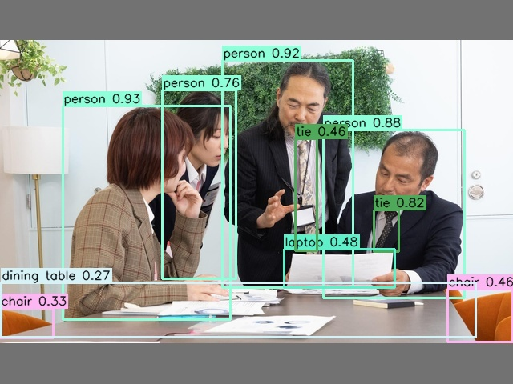
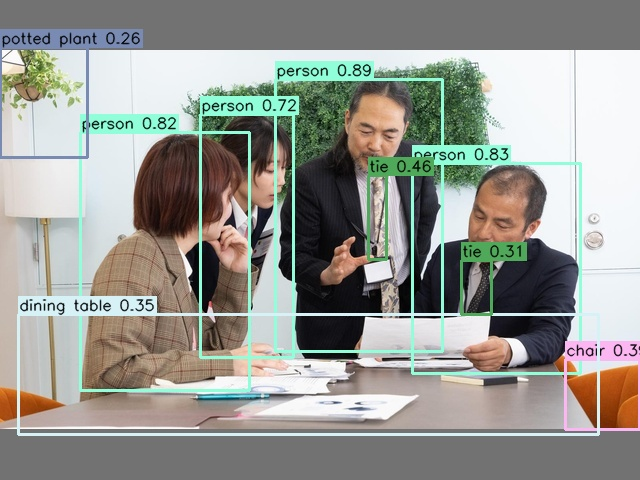
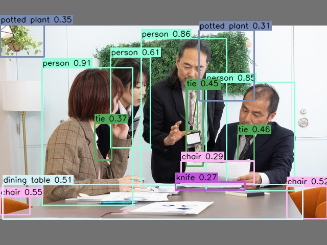
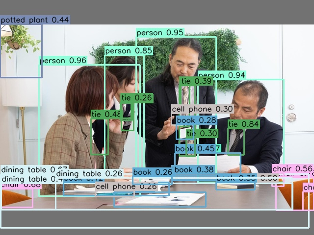
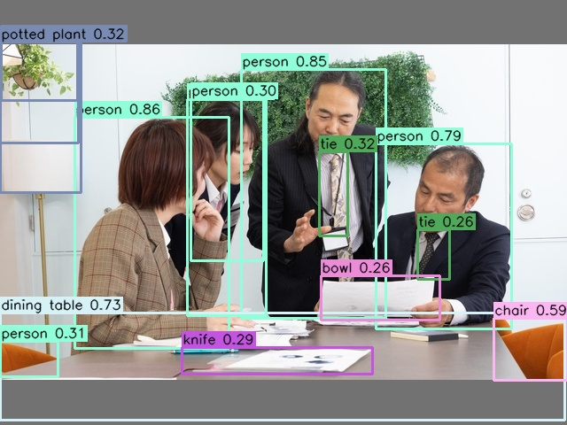
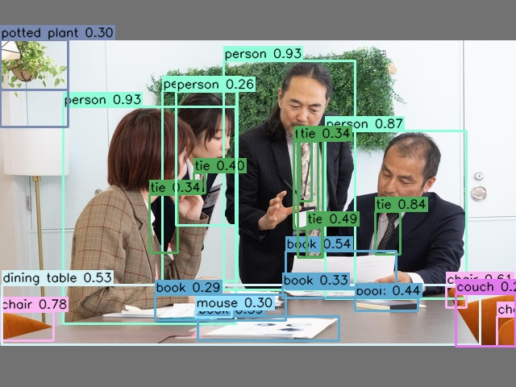
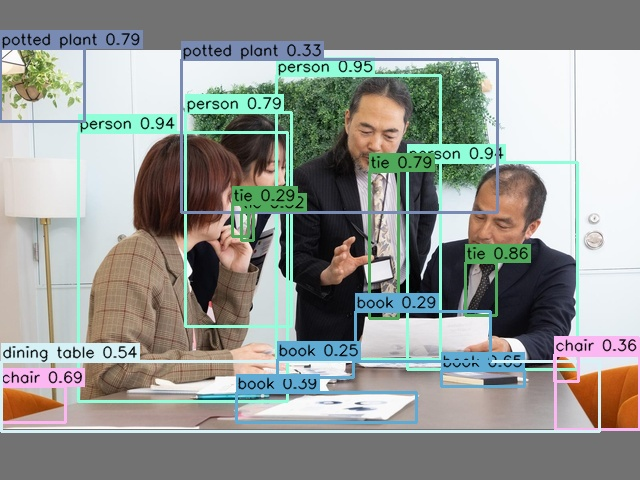

# LibreYOLO ONNX Runtime 推論スクリプト

[LibreYOLO](https://github.com/LibreYOLO/libreyolo)（MIT ライセンスの OSS コンピュータビジョンライブラリ）からエクスポートした 7 種類の物体検出モデルを、**ONNX Runtime + OpenCV + NumPy だけ**で動かす単一ファイル完結の推論スクリプト集です。学習フレームワーク（PyTorch など）に依存せず、CPU だけで動作します。

各スクリプトはモデルファミリーごとに前処理・後処理を最小限の実装で書き分けており、**ONNX にエクスポート済みの検出モデルがどう動いているかを読んで理解する**ことを主眼にしています。クラス名（COCO 80）や入力サイズ `imgsz` は ONNX のメタデータから読み取るため、スクリプト側にハードコードしていません。

> モデル（`*.onnx`）はこのリポジトリには含めていません。**[LibreYOLO](https://github.com/LibreYOLO/libreyolo) からエクスポートして入手します**（手順は[モデルの入手](#モデルの入手)を参照）。

## 対応モデル

| スクリプト | ファミリー | 既定モデル | 入力 | 前処理 | 後処理 |
|---|---|---|---|---|---|
| `infer_yolo9.py` | YOLOv9 | `yolo9_t.onnx` | 640 | letterbox(左上詰め, pad=114) + RGB + /255 | conf → **NMS** → 逆スケール |
| `infer_yolox.py` | YOLOX | `yolox_n.onnx` | 416 | letterbox(左上詰め, pad=114) + BGR + 正規化なし(0–255) | obj×cls → **NMS** → 逆スケール |
| `infer_picodet.py` | PicoDet | `picodet_s.onnx` | 320 | 単純リサイズ + RGB + ImageNet 正規化(0–255 空間) | conf → **NMS** → 逆スケール |
| `infer_dfine.py` | D-FINE | `dfine_n.onnx` | 640 | 単純リサイズ + RGB + /255 | DETR 集合予測 **(NMS フリー)** |
| `infer_deimv2.py` | DEIMv2 | `deimv2_atto.onnx` | 320 | 単純リサイズ + RGB + /255 (`--imagenet` で正規化) | DETR 集合予測 **(NMS フリー)** |
| `infer_rtdetrv4.py` | RT-DETRv4 | `rtdetrv4_s.onnx` | 640 | 単純リサイズ + RGB + /255 | DETR 集合予測 **(NMS フリー)** |
| `infer_rfdetr.py` | RF-DETR | `rfdetr_n.onnx` | 384 | 単純リサイズ + RGB + /255 + ImageNet 正規化 | DETR 集合予測 (NMS フリー / COCO91→80) |

> `imgsz` と既定値は ONNX メタデータがあればそちらを優先します（上表はメタデータが無い場合のフォールバック値）。

## セットアップ

[uv](https://docs.astral.sh/uv/) を使います。Python やパッケージは uv が自動で用意します。

### 方法 A: プロジェクトとして使う

```bash
uv sync                       # .venv を作成し依存関係をインストール
uv run python infer_yolo9.py  # 仮想環境内で実行
```

### 方法 B: スタンドアロンスクリプトとして使う

各スクリプトの先頭には [PEP 723](https://peps.python.org/pep-0723/) のインラインメタデータ（`# /// script ... # ///`）が書かれているため、`uv sync` 無しで直接実行できます。依存関係はその場で解決されます。

```bash
uv run infer_yolo9.py
```

どちらの方法でも結果は同じです。

## 使い方

引数なしで実行すると、既定モデルと同梱の `image/sample_640x480.jpg` を使って推論し、結果画像を `image/sample_640x480_<family>.jpg` として保存します（出力は入力画像と同じディレクトリに保存されます）。

```bash
uv run infer_yolo9.py
uv run infer_yolox.py
uv run infer_picodet.py
uv run infer_dfine.py
uv run infer_deimv2.py
uv run infer_rtdetrv4.py
uv run infer_rfdetr.py
```

### 共通オプション

| オプション | 説明 | 既定 |
|---|---|---|
| `--model PATH` | ONNX モデルのパス | 各スクリプトの既定モデル |
| `--image PATH` | 入力画像 | `image/sample_640x480.jpg` |
| `--out PATH` | 出力画像の保存先 | 入力画像と同じ場所に `<入力名>_<family>.jpg` |
| `--conf FLOAT` | 信頼度のしきい値 | `0.25` |
| `--iou FLOAT` | NMS の IoU しきい値（NMS 使用モデルのみ） | `0.45` |

例:

```bash
# 任意の画像・しきい値で実行
uv run infer_dfine.py --image path/to/image.jpg --conf 0.4 --out result.jpg

# DEIMv2 で DINO バックボーン採用サイズ (s/m/l/x) を使う場合は ImageNet 正規化を有効化
uv run infer_deimv2.py --model deimv2_s.onnx --imagenet

# YOLOv9 の NMS フリー版モデルも同じスクリプトで動く
uv run infer_yolo9.py --model yolo9_e2e_t_nms-free.onnx --conf 0.3
```

実行すると検出結果がコンソールに出力されます:

```
[dfine] model=dfine_n.onnx imgsz=640 image=640x480 detected=3 (NMSフリー)
  - person         0.912 (45,30,210,420)
  - dog            0.874 (300,210,520,460)
  ...
  saved: image/sample_640x480_dfine.jpg
```

## モデルの入手

ONNX モデルファイル（`*.onnx`）はサイズが大きい（合計 ~176MB、`rfdetr_n.onnx` は単体で 100MB 超）ため、**このリポジトリには含めていません**（`.gitignore` 済み）。モデルは [**LibreYOLO**](https://github.com/LibreYOLO/libreyolo) からエクスポートして取得します。LibreYOLO がエクスポートする ONNX には、クラス名 (`names`) と入力サイズ (`imgsz`) がメタデータ (`custom_metadata_map`) として埋め込まれるため、本スクリプトはそのまま読み込めます。

### 1. LibreYOLO をインストール

```bash
uv pip install libreyolo
# ONNX エクスポートに必要な追加依存は LibreYOLO のドキュメントを参照
# https://www.libreyolo.com/docs
```

### 2. 各モデルを ONNX にエクスポート

学習済み重み（`.pt`）は名前を指定するだけで [HuggingFace の LibreYOLO 組織](https://huggingface.co/LibreYOLO) から自動ダウンロードされます。CLI でも Python API でもエクスポートできます。

```bash
# CLI 例 (YOLOv9 tiny を imgsz=640 で ONNX 化)
libreyolo export --model LibreYOLO9t.pt --format onnx --imgsz 640
```

```python
# Python API 例
from libreyolo import LibreYOLO
LibreYOLO("LibreYOLO9t.pt").export(format="onnx", imgsz=640)
```

### 3. 本デモのファイル名にリネームしてリポジトリ直下へ配置

各スクリプトの既定ファイル名は下表のとおりです（`--model` で任意パスを指定すればリネーム不要）。

| 本デモの既定ファイル名 | LibreYOLO チェックポイント | HuggingFace | imgsz |
|---|---|---|---|
| `yolo9_t.onnx` | `LibreYOLO9t.pt` | [LibreYOLO/LibreYOLO9t](https://huggingface.co/LibreYOLO/LibreYOLO9t) | 640 |
| `yolox_n.onnx` | `LibreYOLOXn.pt` | [LibreYOLO/LibreYOLOXn](https://huggingface.co/LibreYOLO/LibreYOLOXn) | 416 |
| `picodet_s.onnx` | `LibrePICODETs.pt` | [LibreYOLO/LibrePICODETs](https://huggingface.co/LibreYOLO/LibrePICODETs) | 320 |
| `dfine_n.onnx` | `LibreDFINEn.pt` | [LibreYOLO/LibreDFINEn](https://huggingface.co/LibreYOLO/LibreDFINEn) | 640 |
| `deimv2_atto.onnx` | `LibreDEIMv2atto.pt` | [LibreYOLO/LibreDEIMv2atto](https://huggingface.co/LibreYOLO/LibreDEIMv2atto) | 320 |
| `rtdetrv4_s.onnx` | RT-DETRv4 (実験的) | LibreYOLO リポジトリ/ドキュメント参照 | 640 |
| `rfdetr_n.onnx` | `LibreRFDETRn.pt` | [LibreYOLO/LibreRFDETRn](https://huggingface.co/LibreYOLO/LibreRFDETRn) | 384 |

> エクスポート時の出力名（例 `LibreYOLO9t.onnx`）を、上表の既定ファイル名（例 `yolo9_t.onnx`）にリネームしてください。
> RT-DETRv4 は LibreYOLO では実験的（`exp`）扱いです。チェックポイント名・入手可否は LibreYOLO 本体のドキュメントを確認してください。

## 検出結果サンプル

同梱の `image/sample_640x480.jpg` に対する各モデルの出力です。

| YOLOv9 | YOLOX | PicoDet |
|---|---|---|
|  |  |  |

| D-FINE | DEIMv2 | RT-DETRv4 |
|---|---|---|
|  |  |  |

| RF-DETR | | |
|---|---|---|
|  | | |

## 実装メモ

- **NMS あり (YOLOv9 / YOLOX / PicoDet)**: 密な予測から信頼度しきい値で絞り込み、`cv2.dnn.NMSBoxes` で重複ボックスを除去します。
- **NMS フリー (D-FINE / DEIMv2 / RT-DETRv4 / RF-DETR)**: DETR 系の集合予測なので NMS は不要。`logits` を sigmoid → `(クエリ×クラス)` を top-k で取り、`cxcywh`（[0,1] 正規化）→ `xyxy` を元画像サイズへスケールするだけです。
- **座標の戻し方**: letterbox 系（YOLOv9/YOLOX）は `1/ratio`、単純リサイズ系（PicoDet ほか）は `orig/imgsz` で元画像座標に戻します。
- **RF-DETR のクラス**: 出力ラベルは COCO91（1 始まり）系なので、`COCO91_TO_80` で COCO80（0 始まり）へ写像し、対象外クラスは破棄します。

## 動作環境

- Python >= 3.10
- onnxruntime >= 1.16.0 / opencv-python >= 4.8.0 / numpy >= 1.21.0
- CPU 実行（`CPUExecutionProvider`）

## ライセンス

スクリプトのライセンスは任意で追加してください（公開リポジトリには `LICENSE` の同梱を推奨します）。各モデルおよびその重みは、上表の上流プロジェクトのライセンスに従います。
